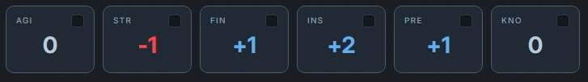

# Traits

The `traits` block shows your six core Daggerheart traits as cards with totals and a proficiency toggle for each:

•  Agility  
•  Strength  
•  Finesse  
•  Instinct  
•  Presence  
•  Knowledge  

It:

•  Combines base trait values with bonuses from YAML.  
•  Renders one card per trait with a short label (AGI, STR, etc.) and the final modifier.  
•  Lets you toggle proficiency on/off per trait; the toggle state is saved via localStorage.  
•  Feeds the trait totals into the template context as both `traits.*` and `abilities.*` (for backwards‑compatibility), so other blocks like badges and features can reference them.

The block is registered under:

•  traits – primary name.  
•  ability – alias.

## YAML structure



The `traits` block expects a small YAML document that describes your Daggerheart **traits**:

•  `abilities` – base trait values (one entry per trait, e.g. `Agility: 1`).  
•  `bonuses` – additional trait bonuses (preferred key).  
•  `trait` – legacy alias for `bonuses` (still supported for older notes).

All three accept maps keyed by trait name, and `bonuses`/`trait` can also be arrays of maps that get summed.

You can either **hard-code numbers** or pull them from frontmatter using simple templates like <span v-pre>`{{ frontmatter.agility }}`</span>. Complex helpers (`add`, `multiply`, etc.) are not supported inside the `traits` block YAML; keep those in other blocks (like `badges`) that read from `traits.*`.
## Example – Base abilities from frontmatter

You can keep numeric values in frontmatter and have the `traits` block read them:

````yaml
---
agility: 0
strength: -1
finesse: 1
instinct: 2
presence: 1
knowledge: 0
---

```traits
abilities:
  Agility: "{{ frontmatter.agility }}"
  Strength: "{{ frontmatter.strength }}"
  Finesse: "{{ frontmatter.finesse }}"
  Instinct: "{{ frontmatter.instinct }}"
  Presence: "{{ frontmatter.presence }}"
  Knowledge: "{{ frontmatter.knowledge }}"
```
````

### Notes

- The `traits` block resolves each <span v-pre>`{{ frontmatter.* }}`</span> to a number (non‑numeric values are treated as 0).  
- Totals for `traits.*` / `abilities.*` in templates still come from `base + bonuses` inside this block.

## Example – Multiple trait sources

You can provide bonuses as a **list** if you want to keep sources separate in YAML:

````yaml
```traits
abilities:
  Agility: 1
  Strength: 0
  Finesse: 0
  Instinct: 0
  Presence: 0
  Knowledge: 0

bonuses:
  - Agility: 1         # from ancestry
    Finesse: 1
  - Presence: 1        # from class
    Presence: 1        # from background
```
````

### Internally, all bonus maps are summed:

- Agility: `1 (base) + 1 = 2`  
- Finesse: `0 (base) + 1 = 1`  
- Presence: `0 (base) + 1 + 1 = 2`  

You can also still use the older `trait:` key instead of `bonuses:`, but new notes should prefer `bonuses:`.

## Proficiency toggles

Each trait card has a small **toggle pill**:

- Clicking the toggle marks that trait as “on” (proficient) or “off”.  
- The state is stored in `localStorage` under a per‑trait key like:  
  `dh:traitToggle:<filePath>:<TraitName>`  
- When the note is reloaded, the block reads those keys and restores the toggles.

Advanced integrations can fire the `dh:ability:refresh` event if they change toggles programmatically; the view listens for that and re‑reads `localStorage`.

## Templates integration (`traits.*`)

The nearest ```traits block in a section is used by the template engine to expose your Daggerheart trait totals.

- After parsing your `traits` YAML, the plugin computes final totals (`base + bonuses`) for each trait.
- Those totals are exposed in templates as `traits.<name>`.
- Examples:
  - <span v-pre>`{{ traits.agility }}`</span>  
  - <span v-pre>`{{ traits.strength }}`</span>  
  - <span v-pre>`{{ traits.knowledge }}`</span>

Names are matched **case‑insensitively**, so `traits.Agility` and `traits.agility` both work.

You can then use these in other blocks, e.g.:

````yaml
```badges
items:
  - label: "Agility"
    value: "{{ traits.agility }}"
  - label: "Presence"
    value: "{{ traits.presence }}"
```
````

or combined with helpers:

````yaml
```badges
items:
  - label: "Defense"
    value: "{{ add traits.agility traits.instinct }}"
```
````

## Configuration summary – `traits` block

Top‑level options:

| Property    | Type                         | Description                                                                 |
| ----------- | ---------------------------- | --------------------------------------------------------------------------- |
| `abilities` | Map `TraitName -> Number`    | Base values for the six Daggerheart traits. Missing ones default to 0.     |
| `bonuses`   | Map or Array of Maps         | Trait bonuses; all maps are summed by trait.                               |
| `trait`     | Map or Array of Maps         | Legacy alias for `bonuses` (still supported but not recommended for new notes). |

## See also

- [Dynamic Content](/concepts/dynamic-content) – how `traits.*` are exposed to templates.
- [State Storage](/concepts/state-storage) – how trait toggles and other values are remembered.
- [Vitals & Trackers](/vitals%20and%20damage/vitals-trackers) – HP/Stress/Armor/Hope trackers that often sit under your traits.
